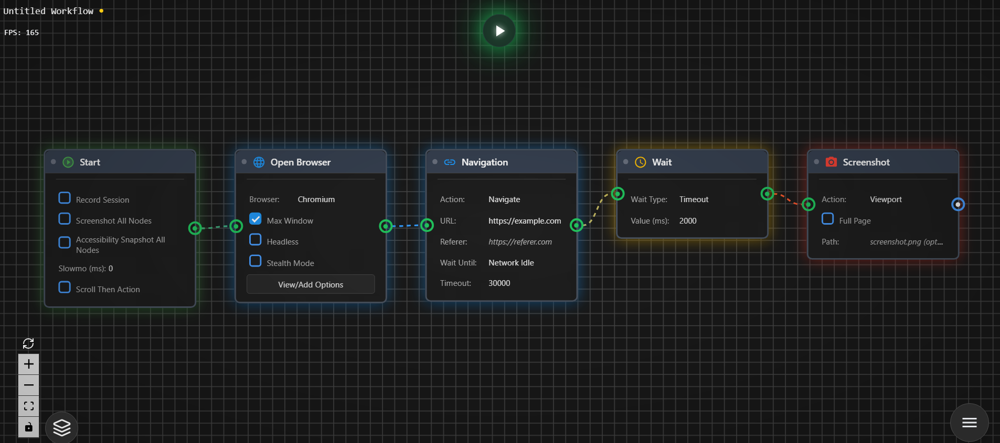

# AutoMFlows - No-Code Browser Automation Tool

[](https://github.com/ashxtrem/AutoMFlows)

AutoMFlows is a web-based visual workflow builder for browser automation, inspired by n8n and ComfyUI. Create complex web automation workflows using a drag-and-drop node-based interface without writing code.
https://github.com/ashxtrem/AutoMFlows



## Features

- **Visual Workflow Editor**: Drag-and-drop node-based interface
- **Browser Automation**: Playwright integration with multi-browser support (Chromium, Firefox, WebKit)
- **Real-time Execution**: Live node highlighting and execution tracking
- **20+ Node Types**: Browser automation, API testing, data manipulation, verification
- **Execution Reporting**: Multi-format reports (HTML, Allure, JSON, JUnit, CSV, Markdown)
- **Retry & Wait Strategies**: Advanced retry mechanisms and flexible wait options
- **Plugin System**: Extensible architecture for custom nodes
- **Type-safe Connections**: Property input connections with automatic type validation

## Architecture

- **Backend**: Node.js/Express server with Playwright execution engine
- **Frontend**: React + ReactFlow visual editor
- **Shared**: TypeScript types and utilities shared across the monorepo
- **MCP Server**: Model Context Protocol server for AI/IDE integration
- **Monorepo**: npm workspaces (`backend`, `frontend`, `shared`, `mcp-server`)

## Getting Started

### Prerequisites

- **Node.js 20+** and npm

### Installing Node.js

You need Node.js 20 or newer. Here are common ways to install it on different operating systems.

**Windows**

- **Official installer**: Download the LTS (20.x) from [nodejs.org](https://nodejs.org/) and run the installer.
- **winget**: `winget install OpenJS.NodeJS.LTS`
- **Chocolatey**: `choco install nodejs-lts`
- **nvm-windows**: [nvm-windows](https://github.com/coreybutler/nvm-windows) — then `nvm install 20` and `nvm use 20`

**macOS**

- **nvm** (recommended): `curl -o- https://raw.githubusercontent.com/nvm-sh/nvm/v0.40.1/install.sh | bash`, then `nvm install 20` and `nvm use 20`
- **Homebrew**: `brew install node@20` (or `brew install node` for latest)
- **Official installer**: Download from [nodejs.org](https://nodejs.org/)

**Linux**

- **nvm**: Same install script as macOS, then `nvm install 20` and `nvm use 20`
- **NodeSource** (Ubuntu/Debian): See [NodeSource distributions](https://github.com/nodesource/distributions#debinstall) for Node 20.
- **Package manager**:  
  - Ubuntu/Debian: `sudo apt update && sudo apt install nodejs npm` (check version; use NodeSource if you need 20+)  
  - Fedora: `sudo dnf install nodejs`  
  - Arch: `sudo pacman -S nodejs npm`

Check your version with:

```bash
node -v   # should be v20.x.x or higher
npm -v
```

### Installation

1. Clone the repository:

```bash
git clone https://github.com/ashxtrem/AutoMFlows.git
cd AutoMFlows
```

2. Install dependencies:

```bash
npm install
```

3. Build shared package:

```bash
cd shared && npm run build && cd ..
```

### Run Project

Start the app with the project script:

**Unix/Linux/macOS:**

```bash
./start.sh
```

**Windows:**

```powershell
.\start.ps1
```

- **Backend**: [http://localhost:3003](http://localhost:3003) (API, Swagger at `/api-docs`)
- **Frontend**: [http://localhost:5173](http://localhost:5173)

## Docker

```bash
cd docker
docker-compose up --build
```

## Usage

1. Drag nodes from the sidebar onto the canvas
2. Connect nodes by dragging between ports
3. Configure nodes in the right sidebar
4. Click **Run** to execute the workflow
5. View results, reports, and screenshots
6. Save/load workflows as JSON

## Node Types

- **Browser**: Start, Open Browser, Navigate
- **Interaction**: Click, Type
- **Data**: Get Text, Screenshot
- **Verification**: Verify (browser & API validation)
- **API**: API Request, API cURL
- **Control**: Wait, Loop
- **Value**: Int, String, Boolean, Input Value
- **Config**: Load Config File, Select Config File
- **Code**: JavaScript Code

## Plugins

AutoMFlows supports plugins for custom nodes. Built-in plugins include:

- **Reusable Node**: Define and execute reusable sub-workflows
- **Switch Node**: Conditional branching
- **Set Config Node**: Set runtime config from workflow
- **Comment Box**: Annotations on the canvas
- **Shortcut**: Keyboard shortcuts in the editor

See [Plugin Development Guide](docs/PLUGIN_DEVELOPMENT.md) for details.

## Repository

- **GitHub**: [https://github.com/ashxtrem/AutoMFlows](https://github.com/ashxtrem/AutoMFlows)

## Security Warning

⚠️ **This tool is intended for local/private network use only.**

The JavaScript Code node executes arbitrary code on the server. Only use this tool in trusted environments.

## License

MIT
